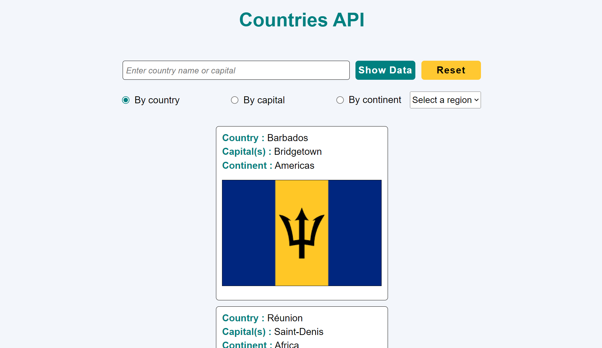

# countries-api-jquery-node-express

Countries API is an application that collects information on any country based on its name, capital or geographical area.

## Table of Contents

- [Stack](#stack)
- [Screenshot](#screenshot)
- [Main features](#main-features)
- [Run the project locally](#run-the-project-locally)
- [Contributing](#contributing)
- [Stay Updated](#stay-updated)
- [Contact](#contact)

## Stack

The technologies used in this project are :

- HTML and CSS,
- jQuery,
- Node.js,
- Express.js.

## Screenshot

## Main features

- Fetch a country information by its name, capital or geographical area using a search form.
- Reset the search form to its initial state.

## Run the project locally

1. Open your terminal and navigate to the location where you want the local repository to be copied.
2. Clone the repository : `git clone https://github.com/jesselessa/countries-api-jquery-node.git`
3. Navigate to the project directory : `cd countries-api-jquery-node`
4. Inside the project directory :
   - Install dependencies : `npm install`
   - Start server : `node server.js`
   - Open `index.html` file in your browser

## Contributing

Feel free to make improvements, fix bugs or suggest new features. Contributions are welcomed !

## Stay updated

To stay updated with the project latest changes, you can pull them from the repository : `git pull origin main`

## Contact

For inquiries, you can contact me via [LinkedIn](https://www.linkedin.com/in/jessica-elessa/).

---

&copy; 2024, Jessica ELESSA - All rights reserved
